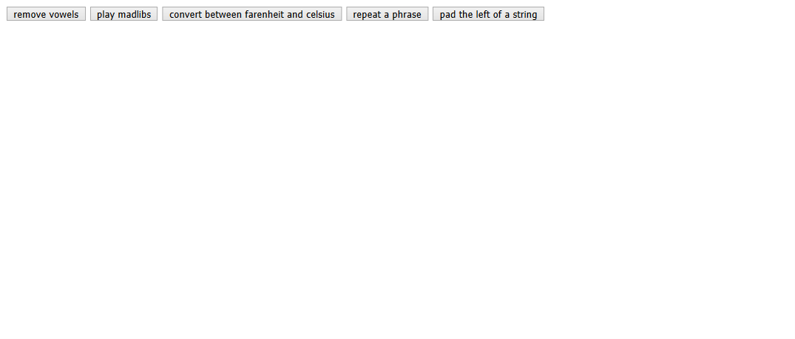

# soc-week-2-project

## Table of contents

- [General info](#general-info)
- [Screenshots](#screenshots)
- [Technologies](#technologies)
- [Setup](#setup)
- [Features](#features)
- [Status](#status)
- [Inspiration](#inspiration)
- [Contact](#contact)

## General info

The Motivation behind this project is to get more comfortable with java-scripts basics , dealing with different types and using different operators and etc..

## Screenshots

This is a screen-shot of the final live demo of this project.

## Technologies

- Pure Java-script and HTML .

## Setup

Clone the repository
Open using Visual studio code ..
Explore...
use VS Debugger to trace code.

## Features

The project is divided into many steps as user-stories is mapped to branches as follows :

| _Step Name_ | Branch Name    |
| ----------- | -------------- |
| step 1-     | madlib         |
| step 2 -    | devvowel       |
| step 3 -    | temp-converter |
| step 4 -    | repeater       |
| step 5 -    | solve-pad-left |

## Status

Project is: finished as it is for learning purpose.

## Inspiration

Based on the https://github.com/HackYourFutureBelgium/soc-week-2-project

## Contact

Created by Rasha Ali https://rashaali84.github.io/ - feel free to contact me over GitHub!
